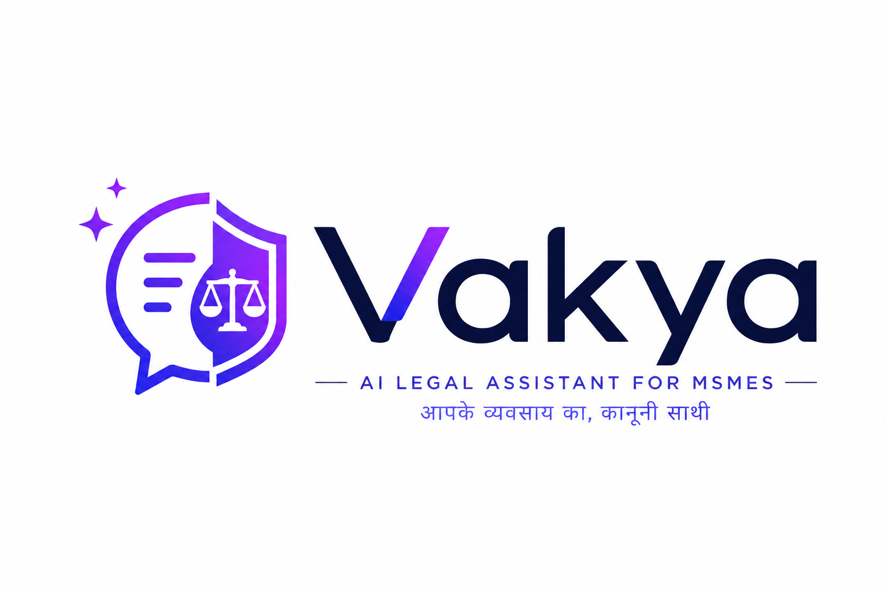
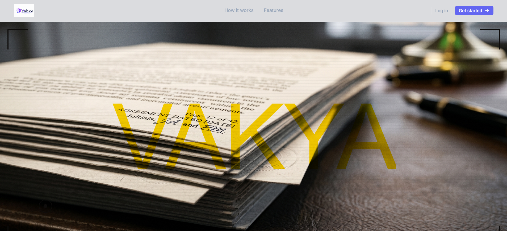
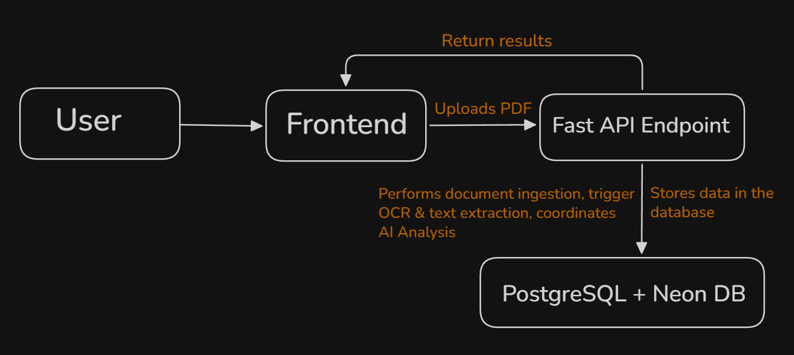
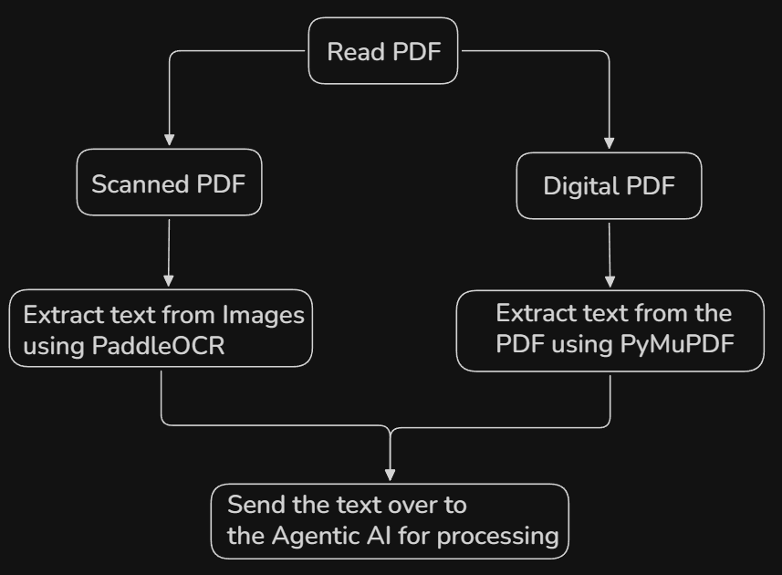
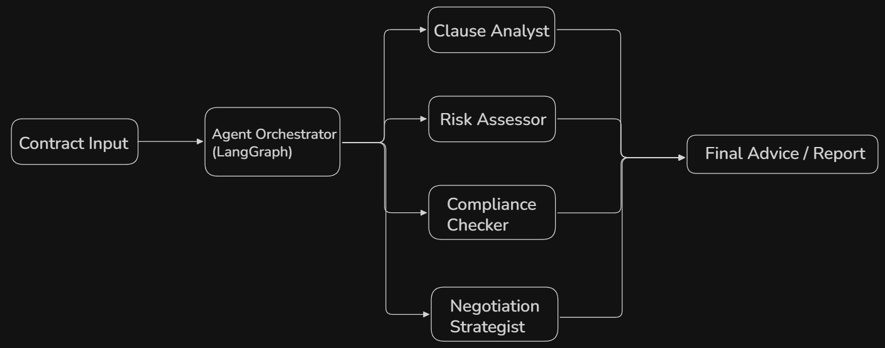
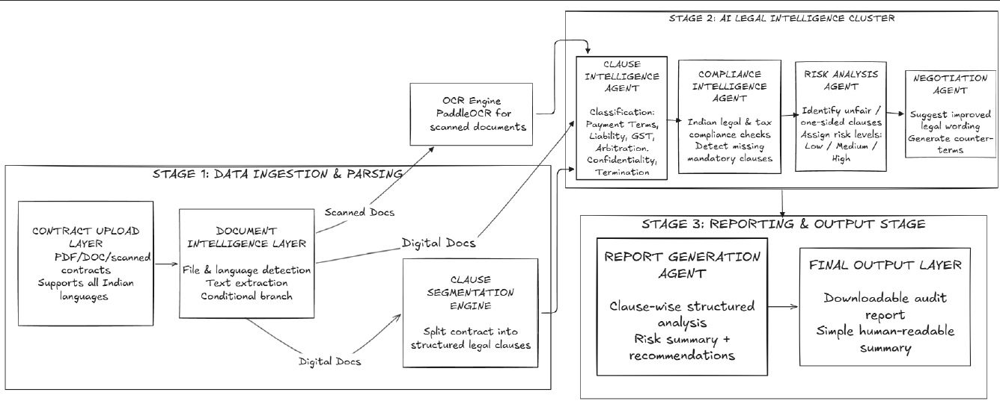

 
  

<h1 align="center"> Vakya: Multi-Agent Legal Analysis Engine </h1>
<h3 align="center"> Automated Contract Risk Mitigation & Segmentation Platform for MSMEs </h3>

 

I have developed Vakya, an automated legal advisory platform engineered specifically for Micro, Small, and Medium Enterprises (MSMEs). The system dynamically parses corporate legal contracts to identify hidden loopholes or structural risks within a bond, informing users in advance to prevent financial or operational losses. When a disadvantageous terms layout is detected, Vakya generates targeted legal advice and optimized text alternatives to empower businesses during contract negotiations.

 

## 🚀 Live Deployment

<a href="<Deployment_In_Process>">
  
</a>

 
 

<h2> :floppy_disk: Architecture & Components </h2>

The application architecture is divided into decoupled microservices and modular processing layers:

<h4>Frontend Directory:</h4>
<ul>
  <li><b>React Framework</b> - Component-driven single-page dashboard utilizing <b>GSAP (GreenSock Animation Platform)</b> for high-performance JavaScript animation timelines, smooth interactive scroll effects, and visual clause parsing.</li>
</ul>

  

<h4>Backend Services:</h4>
<ul>
  <li><b>FastAPI & Uvicorn (API Gateway)</b> - Asynchronous Python web server optimized for high-concurrency request handling, native Pydantic data validation, and secure session decoding via Google OAuth JWT tokens.</li>

  <li><b>Text Extraction Suite</b> - A hybrid text processing engine integrating <b>PyMuPDF</b> for high-speed digital rendering and <b>PaddleOCR</b> for parsing scanned physical documentation into structured text vectors.</li>
</ul>

<h4>Database Layer:</h4>
<ul>
  <li><b>PostgreSQL (NeonDB)</b> - Relational datastore deployed via a serverless infrastructure. It maintains strict transactional consistency across user profiles and utilizes <b>JSONB</b> indexing to execute queries over highly dynamic, semi-structured AI clause analytics with minimal latency.</li>
</ul>

<h4>Agentic AI Core:</h4>
<ul>
  <li><b>Local Inference Compute</b> - Built around <b>Ollama</b> to run localized LLM inference tasks, executing isolated instruction prompts across specialized, task-allocated computational micro-agents.</li>
</ul>

<h2> :book: Agentic AI Orchestration & Logic </h2>

Executing complex contract validation within a monolithic single-prompt model layout introduces high probabilities of context degradation and hallucinations. Abstractly, Vakya resolves this problem by separating architectural orchestration into distinct procedural and state-driven graph systems.

<h4>The Specialized Agent Mesh</h4>

To ensure structural consistency and eliminate conversational straying, contract text is distributed across a mesh composed of 4 specialized micro-agents:

<ul>
  <li><b>Clause Analyst:</b> Receives the raw text strings and segments them into structured semantic boundaries.</li>
  <li><b>Risk Assessor:</b> Compares isolated clauses against corporate legal vulnerabilities.</li>
  <li><b>Compliance Checker:</b> Validates contract sentences against standardized regulatory constraints.</li>
  <li><b>Negotiation Strategist:</b> Translates flagged data returns into tactical risk-mitigated clause options.</li>
</ul>

Vakya systematically quotes the exact legal clauses alongside their calculated risks, ensuring a clear, transparent audit trail highlighting exactly why a particular sentence is being flagged.

